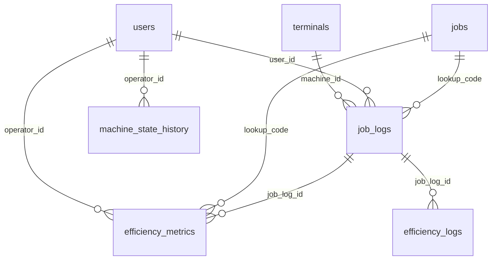

# Manufacturing Terminal System Database Schema

## Overview

This document provides a comprehensive reference for the Manufacturing Terminal System database schema. The database is designed to support a manufacturing shop floor capture application, tracking jobs, terminals, users, and efficiency metrics throughout the production process.

## Tables

* [terminals](#terminals) - Machine terminals on the shop floor
* [users](#users) - System users with role-based permissions
* [jobs](#jobs) - Manufacturing jobs with planning details
* [job_logs](#job_logs) - Detailed logging of job operations
* [efficiency_metrics](#efficiency_metrics) - Performance metrics for operations
* [efficiency_logs](#efficiency_logs) - Legacy efficiency tracking
* [machine_state_history](#machine_state_history) - Machine state changes over time
* [rejects](#rejects) - Records of rejected parts
* [inspection_types](#inspection_types) - Types of inspections performed

## Table Relationships

## Detailed Schema

### terminals

Stores information about physical terminals located throughout the factory floor.

| Column | Type | Constraints | Description |
|--------|------|-------------|-------------|
| terminal_id | serial4 | PRIMARY KEY | Unique identifier |
| terminal_name | varchar(50) | NOT NULL, UNIQUE | Human-readable name |
| operation_code | varchar(20) | NOT NULL | Type of operation performed |
| description | text | NULL | Terminal description |
| password | varchar(100) | NOT NULL | Authentication credential |
| active | bool | DEFAULT true | Whether terminal is active |
| created_at | timestamp | DEFAULT CURRENT_TIMESTAMP | Creation timestamp |

### users

Stores user information with role-based permissions.

| Column | Type | Constraints | Description |
|--------|------|-------------|-------------|
| user_id | serial4 | PRIMARY KEY | Unique identifier |
| employee_id | varchar(20) | NOT NULL, UNIQUE | Employee ID for authentication |
| name | varchar(100) | NOT NULL | User's full name |
| active | bool | DEFAULT true | Whether user account is active |
| can_operate | bool | DEFAULT false | Permission to operate machines |
| can_setup | bool | DEFAULT false | Permission to perform setups |
| can_inspect | bool | DEFAULT false | Permission to perform inspections |
| can_remanufacture | bool | DEFAULT false | Permission to handle remanufacturing |

### jobs

Stores manufacturing job information.

| Column | Type | Constraints | Description |
|--------|------|-------------|-------------|
| lookup_code | varchar(50) | PRIMARY KEY | Unique identifier for job scanning |
| contract_number | int4 | NOT NULL | External reference number |
| route_card | int4 | NOT NULL | Manufacturing route card number |
| part_number | varchar(50) | NOT NULL | Part identifier |
| op_code | varchar(20) | NOT NULL | Operation code |
| planned_setup_time | numeric | NULL | Expected setup duration in minutes |
| planned_run_time | numeric | NULL | Expected run duration in minutes |
| quantity | int4 | NULL | Total required quantity |
| created_at | timestamp | DEFAULT CURRENT_TIMESTAMP | Creation timestamp |
| customer_code | varchar(20) | NULL | Customer code identifier |
| customer_name | varchar(200) | NULL | Client name |
| description | text | NULL | Part description |
| due_date | date | NULL | Completion deadline |
| balance | int4 | NULL | Remaining quantity |
| status | varchar(20) | DEFAULT 'Unstarted' | Current job status |
| completed_qty | int4 | DEFAULT 0 | Total completed so far |

### job_logs

Tracks job events including setups, runs, pauses, and inspections.

| Column | Type | Constraints | Description |
|--------|------|-------------|-------------|
| log_id | serial4 | PRIMARY KEY | Unique identifier |
| lookup_code | varchar(50) | FOREIGN KEY | Reference to jobs table |
| user_id | varchar(20) | NOT NULL | User who performed action |
| state | varchar(20) | NOT NULL | State type (SETUP, RUNNING, PAUSED, INSPECTION) |
| start_time | timestamp | NOT NULL | Start time of operation |
| end_time | timestamp | NULL | End time of operation (NULL if ongoing) |
| inspection_passed | bool | NULL | Whether inspection passed (for INSPECTION state) |
| comments | text | NULL | Notes about the operation |
| created_at | timestamp | DEFAULT CURRENT_TIMESTAMP | Creation timestamp |
| machine_id | varchar(50) | NULL | Terminal ID where action occurred |
| inspection_type | varchar(20) | NULL | Type of inspection performed |
| inspection_qty | int4 | NULL | Quantity inspected |
| completed_qty | int4 | NULL | Quantity completed in this operation |

**Indexes:**
- `idx_job_logs_lookup` on `lookup_code`

### efficiency_metrics

Tracks performance metrics for setup and running operations.

| Column | Type | Constraints | Description |
|--------|------|-------------|-------------|
| metric_id | serial4 | PRIMARY KEY | Unique identifier |
| job_log_id | int4 | FOREIGN KEY | Reference to job_logs table |
| lookup_code | varchar(50) | FOREIGN KEY | Reference to jobs table |
| operator_id | varchar(20) | FOREIGN KEY | User who performed operation |
| machine_id | varchar(50) | NULL | Terminal where operation occurred |
| metric_type | varchar(20) | NULL | Type of metric (SETUP, RUNNING) |
| planned_time | numeric | NULL | Planned duration in minutes |
| actual_time | numeric | NULL | Actual duration in minutes |
| planned_qty | int4 | NULL | Planned quantity (for RUNNING) |
| completed_qty | int4 | NULL | Completed quantity (for RUNNING) |
| efficiency_percentage | numeric | NULL | Efficiency percentage |
| time_saved | numeric | NULL | Time saved in minutes (positive = saved, negative = overrun) |
| created_at | timestamp | DEFAULT CURRENT_TIMESTAMP | Creation timestamp |

**Indexes:**
- `idx_efficiency_date` on `created_at`

### efficiency_logs

Legacy table for tracking efficiency metrics (consider using efficiency_metrics instead).

| Column | Type | Constraints | Description |
|--------|------|-------------|-------------|
| log_id | serial4 | PRIMARY KEY | Unique identifier |
| job_log_id | int4 | NOT NULL, FOREIGN KEY | Reference to job_logs table |
| lookup_code | varchar(255) | NOT NULL | Reference to jobs |
| log_type | varchar(20) | NOT NULL, CHECK | Type (SETUP, RUNNING) |
| planned_time | numeric(10,2) | NOT NULL | Planned duration in minutes |
| actual_time | numeric(10,2) | NOT NULL | Actual duration in minutes |
| efficiency | numeric(10,2) | NOT NULL | Efficiency percentage |
| time_difference | numeric(10,2) | NOT NULL | Time saved in minutes |
| quantity | int4 | NULL | Quantity for RUNNING logs |
| created_at | timestamp | DEFAULT CURRENT_TIMESTAMP | Creation timestamp |

**Indexes:**
- `idx_efficiency_logs_log_type` on `log_type`

### machine_state_history

Tracks changes in machine state over time.

| Column | Type | Constraints | Description |
|--------|------|-------------|-------------|
| history_id | serial4 | PRIMARY KEY | Unique identifier |
| machine_id | varchar(50) | NOT NULL | Terminal identifier |
| state | varchar(20) | NOT NULL | Machine state |
| operator_id | varchar(20) | FOREIGN KEY | User responsible for state change |
| start_time | timestamp | NOT NULL, DEFAULT CURRENT_TIMESTAMP | Start time of state |
| end_time | timestamp | NULL | End time of state (NULL if current) |
| elapsed_time | interval | NULL | Total duration in this state |

### rejects

Records parts that failed quality inspection and require rework.

| Column | Type | Constraints | Description |
|--------|------|-------------|-------------|
| reject_id | serial4 | PRIMARY KEY | Unique identifier |
| customer_name | varchar(200) | NOT NULL | Client name |
| contract_number | int4 | NOT NULL | External reference number |
| route_card | int4 | NOT NULL | Manufacturing route card number |
| part_number | varchar(50) | NOT NULL | Part identifier |
| qty_rejected | int4 | NOT NULL | Quantity rejected |
| operator_id | varchar(20) | NOT NULL | User who logged reject |
| supervisor_id | varchar(20) | NOT NULL | Supervisor who approved reject |
| reason | varchar(100) | NOT NULL | Reason for rejection |
| remanufacture_qty | int4 | NOT NULL | Quantity to be reworked |
| machine_id | varchar(50) | NOT NULL | Terminal where reject occurred |
| operation_code | varchar(20) | NOT NULL | Operation code |
| created_at | timestamp | DEFAULT CURRENT_TIMESTAMP | Creation timestamp |

### inspection_types

Defines the types of inspections that can be performed.

| Column | Type | Constraints | Description |
|--------|------|-------------|-------------|
| type_id | serial4 | PRIMARY KEY | Unique identifier |
| name | varchar(50) | NOT NULL | Inspection type name |
| description | text | NULL | Description of inspection type |
| requires_qty | bool | DEFAULT false | Whether quantity must be specified |

## Sequences

The database uses the following sequences for auto-incrementing IDs:

- `efficiency_logs_log_id_seq`
- `efficiency_metrics_metric_id_seq`
- `inspection_types_type_id_seq`
- `job_logs_log_id_seq`
- `machine_state_history_history_id_seq`
- `rejects_reject_id_seq`
- `terminals_terminal_id_seq`
- `users_user_id_seq`

## Common Workflows

### Job Lifecycle
1. Job is scanned at a terminal (`jobs` table)
2. Setter authenticates and begins setup (`job_logs` with state='SETUP')
3. First-off inspection is performed (`job_logs` with state='INSPECTION')
4. Operator authenticates and begins production (`job_logs` with state='RUNNING')
5. Job may be paused if needed (`job_logs` with state='PAUSED')
6. Running is completed with quantity logged (`job_logs` end_time and completed_qty)
7. Efficiency is calculated and stored (`efficiency_metrics`)
8. Job status is updated (`jobs` status, completed_qty, and balance)

### Efficiency Tracking
1. Setup and run times are logged in `job_logs`
2. Efficiency metrics are calculated comparing planned vs. actual times
3. Results are stored in `efficiency_metrics`
4. This data can be analyzed to improve future planning

## Schema Conventions

- Most tables include `created_at` timestamps for audit tracking
- Foreign keys maintain referential integrity
- Check constraints enforce valid values (e.g., log_type in efficiency_logs)
- Indexes are created on frequently queried columns

## Notes

- The `efficiency_logs` table appears to be a legacy version of `efficiency_metrics` and may be deprecated in future versions
- Double sequences exist for each table (e.g., `efficiency_logs_log_id_seq` and `efficiency_logs_log_id_seq1`) which may indicate a migration or replication setup
